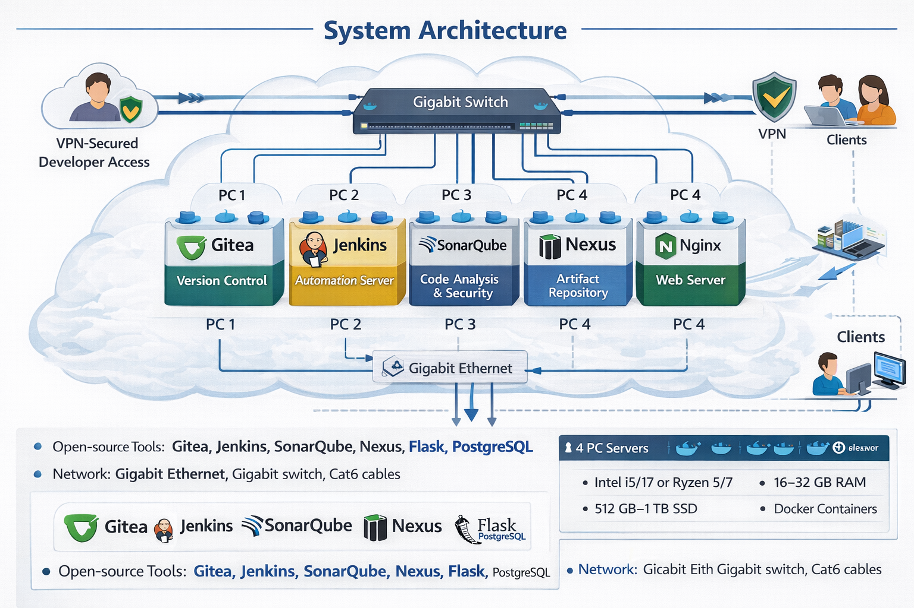
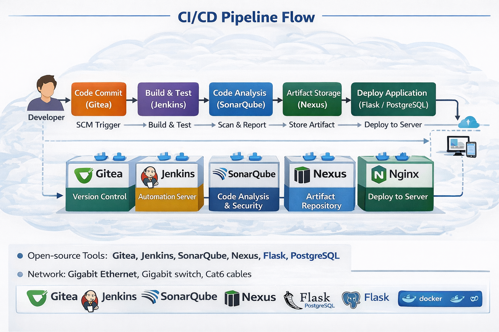

# 🚀 DevSecOps-Enabled Local File Storage System

A **research-driven DevSecOps project** that implements a **secure, automated CI/CD pipeline** for a **local Google Drive–like file storage system**, built entirely using **open-source tools**. This project embeds **security at every stage of the software lifecycle**, demonstrating real-world DevSecOps practices suitable for academic, enterprise, and on‑premise environments.

---

## 📌 Project Overview

Traditional DevOps pipelines prioritize speed and automation but often **neglect security**, making systems vulnerable to code flaws, misconfigurations, and attacks. This project bridges that gap by integrating **DevSecOps principles**, ensuring that **security, quality, and automation coexist seamlessly**.

The system enables:

* Secure version-controlled development
* Automated testing and static code analysis
* Artifact management
* Controlled deployment of backend and frontend services
* Role-based and network-level security

---

## 🎯 Objectives

* Design and implement a **secure CI/CD pipeline** using open-source tools
* Embed **security checks** directly into the development workflow
* Automate build, test, analysis, and deployment stages
* Demonstrate a **scalable, fault-tolerant DevOps infrastructure**
* Promote a **security-first mindset** among developers

---

## ❓ Problem Statement

Most academic and small-scale projects suffer from:

* Manual testing and deployment
* Lack of structured DevOps pipelines
* Poor integration between tools
* Delayed feedback and inconsistent builds
* Minimal focus on security

This project proposes a **unified DevSecOps system** that automates code management, testing, analysis, and deployment within a **single secure environment**, improving reliability, collaboration, and delivery speed.

---

## 🧠 Methodology (CI/CD Flow)

1. Developer commits source code to **Gitea**
2. **Jenkins** automatically triggers the pipeline
3. **SonarQube** performs static code analysis for:

   * Bugs
   * Code smells
   * Security vulnerabilities
4. Verified build artifacts are stored in **Nexus Repository**
5. Backend application (**Flask + PostgreSQL**) is deployed
6. **Nginx** serves the frontend to users
7. **VPN Gateway** ensures secure developer and admin access

---

## 🏗️ System Architecture (Textual Representation)

```


```

---

## 🔁 Pipeline Flowchart (Logical Flow)

```



```

---

## 🧩 System Components

### 🔹 Version Control

* **Gitea** – Self-hosted Git service
* Lightweight, fast, and ideal for on‑prem setups

### 🔹 CI/CD Automation

* **Jenkins** – Pipeline orchestration
* Automates build, test, analysis, and deployment

### 🔹 Security & Code Quality

* **SonarQube** – Static Application Security Testing (SAST)
* Detects vulnerabilities early in development

### 🔹 Artifact Management

* **Nexus Repository** – Stores verified build artifacts
* Prevents redeployment of untrusted binaries

### 🔹 Backend Services

* **Flask (Python)** – REST API backend
* **PostgreSQL** – Relational database

### 🔹 Frontend & Delivery

* **Nginx** – Reverse proxy and frontend server

### 🔹 Infrastructure & Security

* **VPN Gateway** – Secure developer access
* **Proxmox VE** – Virtualization platform
* **Docker & Containers** – Service isolation

---

## 🛠️ Tech Stack

### Software Components

| Layer          | Tools             |
| -------------- | ----------------- |
| OS             | Ubuntu Server LTS |
| VCS            | Gitea             |
| CI/CD          | Jenkins           |
| Code Analysis  | SonarQube         |
| Artifact Repo  | Nexus             |
| Backend        | Flask (Python)    |
| Database       | PostgreSQL        |
| Web Server     | Nginx             |
| Storage        | GlusterFS         |
| Virtualization | Proxmox VE        |
| Containers     | Docker            |

### Hardware Components

* **Server Nodes (4 PCs)**

  * Intel i5/i7 or Ryzen 5/7
  * 8–32 GB RAM
  * 512 GB – 1 TB SSD
  * Gigabit Ethernet
* **Client Systems**

  * i3/i5 CPUs
  * 4–8 GB RAM

---

## 🔐 Security Features

* Static security scanning (SonarQube)
* VPN-based access control
* Isolated services using containers
* Artifact integrity via Nexus
* Secure SSH-based administration

---

## 📊 Comparison with Existing Systems

| Platform  | Strengths                 | Limitations                          |
| --------- | ------------------------- | ------------------------------------ |
| GitHub    | Easy collaboration, CI/CD | Internet dependency, limited control |
| GitLab    | Integrated DevOps suite   | High resource usage                  |
| Travis CI | Simple setup              | Slow free-tier builds                |
| CircleCI  | Fast pipelines            | Weak on‑prem support                 |

➡️ **Our system excels in offline, on‑premise, and academic environments**.

---

## 📈 Outcomes & Benefits

* Reduced manual intervention
* Faster feedback cycles
* Improved code quality
* Secure and repeatable deployments
* Real-world DevSecOps exposure

---

## 🔮 Future Enhancements

* Kubernetes-based orchestration
* Docker image scanning
* Monitoring with Prometheus & Grafana
* Centralized logging (ELK Stack)
* Cloud deployment (AWS / GCP)
* Role-Based Access Control (RBAC)

---

## 📚 References

* Tanenbaum & Van Steen – *Distributed Systems*
* Len Bass et al. – *DevOps: A Software Architect’s Perspective*
* Docker, Kubernetes, AWS, PostgreSQL, Flask Documentation

---

## 👨‍💻 Team

**Joy Banerjee** (1023106)
**Vidushi Bhardwaj** (1023108)
**Faheem Madhia** (1023158)
**Ranjeet Mali** (1023160)

**Institute:** IISER
**Academic Year:** 2025–26

---

⭐ *This project demonstrates how security, automation, and scalability can coexist when DevSecOps is implemented correctly.*
